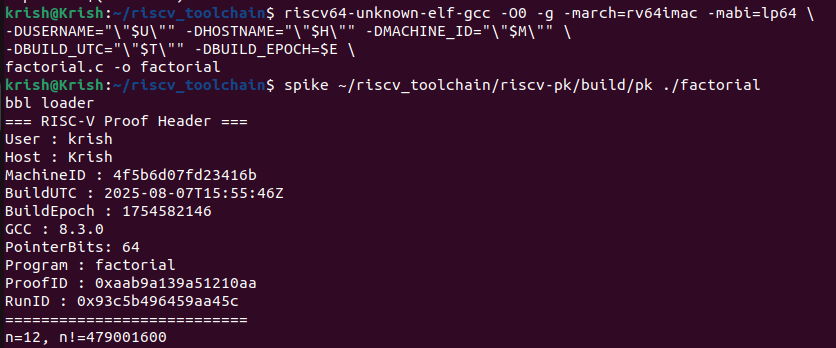
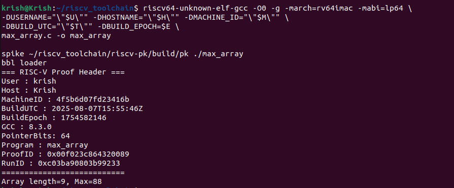
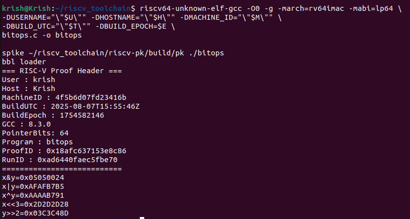
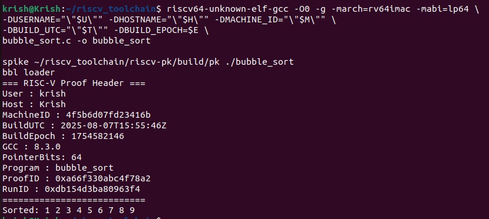
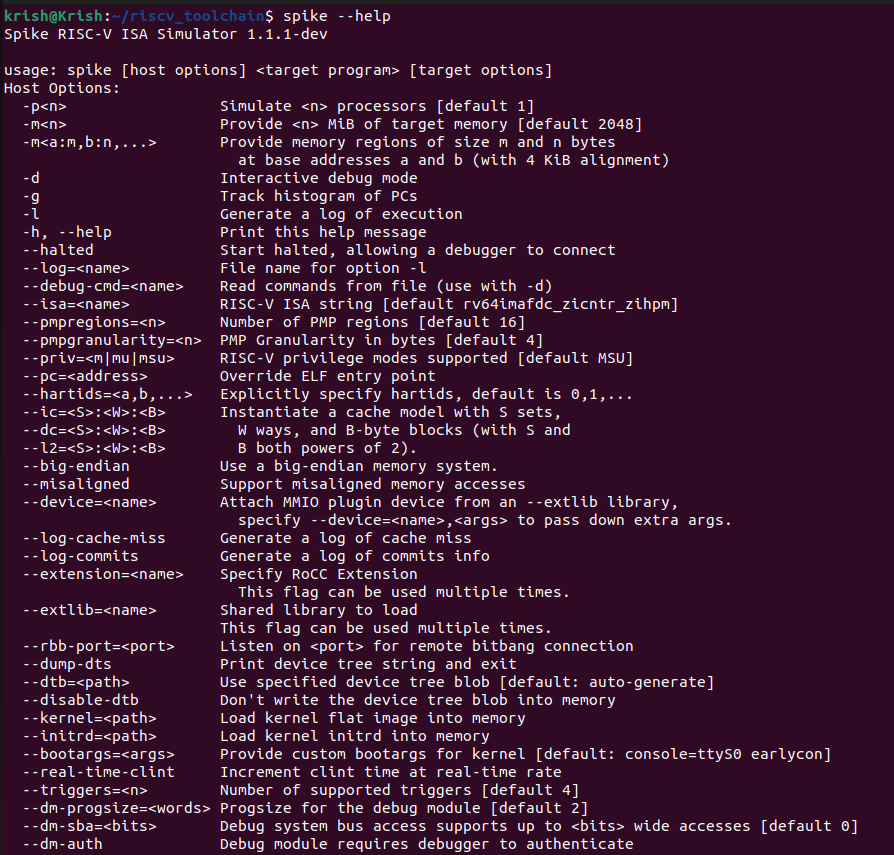
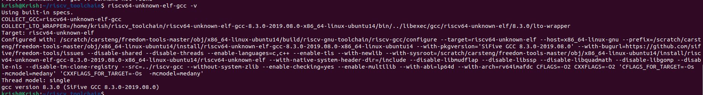

# 🚀 Task 2: RISC-V Local Setup, Compilation & Instruction Decoding

This repository documents the complete workflow for Task 2, including setting up local metadata in RISC-V programs, compiling with the toolchain, disassembling, decoding instructions, and validating output through Spike.

---

## 📌 Table of Contents

- [TASK-2.1 — Environment Setup](#task-21--environment-setup)
- [TASK-2.2 — Adding unique.h](#task-22--adding-uniqueh)
- [TASK-2.3 — Creating C Source Files](#task-23--creating-c-source-files)
  - [2.3.1 — factorial.c](#231--factorialc)
  - [2.3.2 — max_array.c](#232--max_arrayc)
  - [2.3.3 — bitops.c](#233--bitopsc)
  - [2.3.4 — bubble_sort.c](#234--bubble_sortc)
- [TASK-2.4 — Compiling Programs](#task-24--compiling-programs)
- [TASK-2.5 — Running with Spike](#task-25--running-with-spike)
- [TASK-2.6 — Generating Assembly](#task-26--generating-assembly)
- [TASK-2.7 — Extracting Disassembly of main](#task-27--extracting-disassembly-of-main)
- [TASK-2.8 — Output Screenshots](#task-28--output-screenshots)
- [TASK-2.9 — Instruction Decoding](#task-29--instruction-decoding)
- [TASK-2.10 — Tool Version Checks](#task-210--tool-version-checks)

---

## TASK-2.1 — Environment Setup

Run the following in your terminal before compilation:

```bash
export U=$(id -un)
export H=$(hostname -s)
export M=$(cat /etc/machine-id | head -c 16)
export T=$(date -u +%Y-%m-%dT%H:%M:%SZ)
export E=$(date +%s)
```

---

## TASK-2.2 — Adding `unique.h`

> This header file is used to embed identity info (user, host, time, machine) into each compiled binary.

Paste the `unique.h` file contents here or refer to your local copy.

---

## TASK-2.3 — Creating C Source Files

Each file includes `#include "unique.h"` at the top and uses `uniq_print_header()`.

### 2.3.1 — factorial.c
```c
// INSERT factorial.c code here
```

### 2.3.2 — max_array.c
```c
// INSERT max_array.c code here
```

### 2.3.3 — bitops.c
```c
// INSERT bitops.c code here
```

### 2.3.4 — bubble_sort.c
```c
// INSERT bubble_sort.c code here
```

---

## TASK-2.4 — Compiling Programs

Use the following command for each file, replacing `<program>`:

```bash
riscv64-unknown-elf-gcc -O0 -g -march=rv64imac -mabi=lp64 \
-DUSERNAME="\"$U\"" -DHOSTNAME="\"$H\"" -DMACHINE_ID="\"$M\"" \
-DBUILD_UTC="\"$T\"" -DBUILD_EPOCH=$E \
<program>.c -o <program>
```

---

## TASK-2.5 — Running with Spike

Use the compiled programs with Spike + Proxy Kernel:

```bash
spike ~/riscv_toolchain/riscv-pk/build/pk ./<program>
```

---

## TASK-2.6 — Generating Assembly

```bash
riscv64-unknown-elf-gcc -O0 -S <program>.c -o <program>.s
```

---

## TASK-2.7 — Extracting Disassembly of `main`

```bash
riscv64-unknown-elf-objdump -d ./<program> | sed -n '/<main>:/,/^$/p' > <program>_main_objdump.txt
```

---

## TASK-2.8 — Output Screenshots


- factorial: 
- maxarray: 
- bitops: 
- bubblesort: 


---

## TASK-2.9 — Instruction Decoding

Instruction decoding (at least 5) is included in `instruction_decoding.md`. Example format:

| Instr | Opcode | rd | rs1 | rs2 | funct3 | funct7 | Binary | Description |
|-------|--------|----|-----|-----|--------|--------|--------|-------------|
| add x5,x6,x7 | 0110011 | x5 | x6 | x7 | 000 | 0000000 | 00000000011100110000001010110011 | x5 = x6 + x7 |

---

## TASK-2.9 — Instruction Decoding


| Instr | Opcode | rd | rs1 | rs2 | funct3 | funct7 | Binary | Description |
|-------|--------|----|-----|-----|--------|--------|--------|-------------|
| add x5,x6,x7 | 0110011 | x5 | x6 | x7 | 000 | 0000000 | 00000000011100110000001010110011 | x5 = x6 + x7 |

---

## TASK-2.10 — Tool Version Checks

- spike version: 
- gcc version : 
